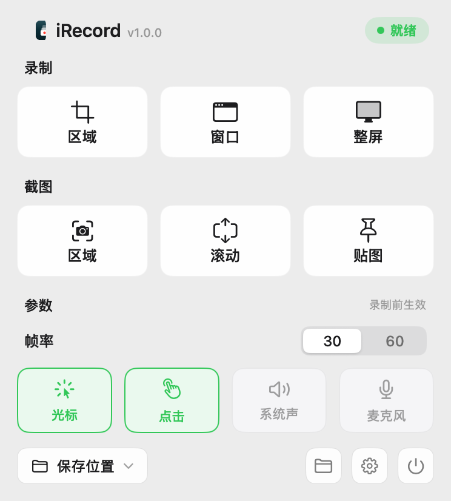

# iRecord

**简体中文** · [English](README.en.md)

iRecord 是一款原生 macOS 菜单栏工具，提供录屏、截图、标注、OCR 和命令行控制。打开后从菜单栏图标进入主菜单，不占用 Dock。



## 主要功能

- **录屏**：录制区域、窗口或整个屏幕；支持暂停与继续，以及光标、点击高亮、系统声音和麦克风。停止后可预览、裁剪并导出 MP4、MOV 或 GIF。
- **截图**：框选后可移动或调整选区；支持滚动截图、箭头与文字等标注、贴图，以及从原始截图提取文字。双击选区内外会复制截图，Esc 放弃。
- **保存与快捷键**：分别设置录屏和截图的保存位置、格式及全局快捷键。若与其他截图工具冲突，可在「设置 → 快捷键」中改绑，例如将区域截图设为 ⌥⌘E。
- **Agent / 脚本控制**：内置 `irecord` 命令行工具，可搜索窗口并控制录屏开始、暂停、继续和停止。

## 安装与使用

1. 从 [Releases](https://github.com/dy1945/iRecord/releases) 下载 macOS Apple Silicon 安装包，解压后将 `iRecord.app` 放入「应用程序」。
2. 打开 iRecord，在系统提示时授予屏幕录制权限；需要录制麦克风时再授予麦克风权限。
3. 点击菜单栏图标，选择录屏或截图方式。长时间运行时可在设置中开启「开机自动启动」。

需要 macOS 13 或更新版本。当前下载包采用临时签名，覆盖升级后 macOS **可能要求重新授权**屏幕录制；遇到权限提示时，请退出 App，在「系统设置 → 隐私与安全性」检查授权后重新打开。

## 命令行

在「设置 → 通用 → 命令行工具」点击安装，然后运行 `irecord -h` 查看完整命令。常用命令：

```bash
irecord status --json
irecord ls --search Chrome --json
irecord start --window-id ID --json
irecord pause --session-id ID --json
irecord resume --session-id ID --json
irecord stop --session-id ID --json
```

录屏沿用 App 的保存设置；可用 `--crop-points` 裁去浏览器地址栏、`--max-edge` 限制输出尺寸。详见 [命令行使用说明](docs/CLI.zh-CN.md)。

Agent 也可以调用 `irecord` 截取单个浏览器窗口为 PNG。先用 `irecord ls --json` 找到正确的窗口 ID，再用 `irecord preview` 保存一张完整截图并检查页面，最后按窗口逻辑点裁掉顶部地址栏：

```bash
irecord preview --window-id ID --output /tmp/browser-full.png --json
irecord preview --window-id ID --output /tmp/browser-page.png --crop-points 87,0,0,0 --json
```

`87` 只是示例。Agent 应根据实际浏览器窗口测量并复查最终图片；[完整调用流程](docs/CLI.zh-CN.md#agent-用-irecord-截取浏览器页面)也说明了如何找到 `irecord`。当前 CLI 窗口录屏不包含屏幕上的鼠标点击涟漪，未提供单独的点击效果参数。

## 从源码构建

安装 Xcode Command Line Tools 后，在仓库根目录运行：

```bash
./scripts/build_app.sh release
open build/iRecord.app
```

源码构建的版本可能比最新 Release 更新。使用 `./scripts/install_app.sh` 可将构建结果安装到 `/Applications`；安装前请先退出正在运行的 iRecord。
